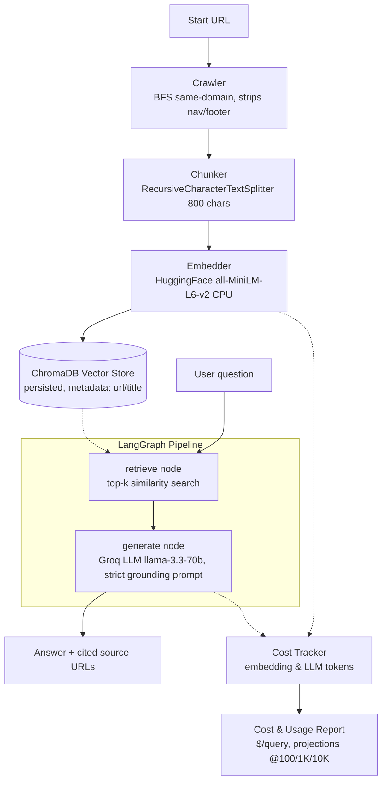

# Architecture Diagram

```mermaid
flowchart TD
    A[Start URL] --> B[Crawler\nBFS same-domain, strips nav/footer]
    B --> C[Chunker\nRecursiveCharacterTextSplitter 800 chars]
    C --> D[Embedder\nHuggingFace all-MiniLM-L6-v2 CPU]
    D --> E[(ChromaDB Vector Store\npersisted, metadata: url/title)]

    subgraph LangGraph Pipeline
        F[retrieve node\ntop-k similarity search] --> G[generate node\nGroq LLM llama-3.3-70b, strict grounding prompt]
    end

    Q[User question] --> F
    E -.-> F
    G --> H[Answer + cited source URLs]

    D -.-> T[Cost Tracker\nembedding & LLM tokens]
    G -.-> T
    T --> R[Cost & Usage Report\n$/query, projections @100/1K/10K]
```
